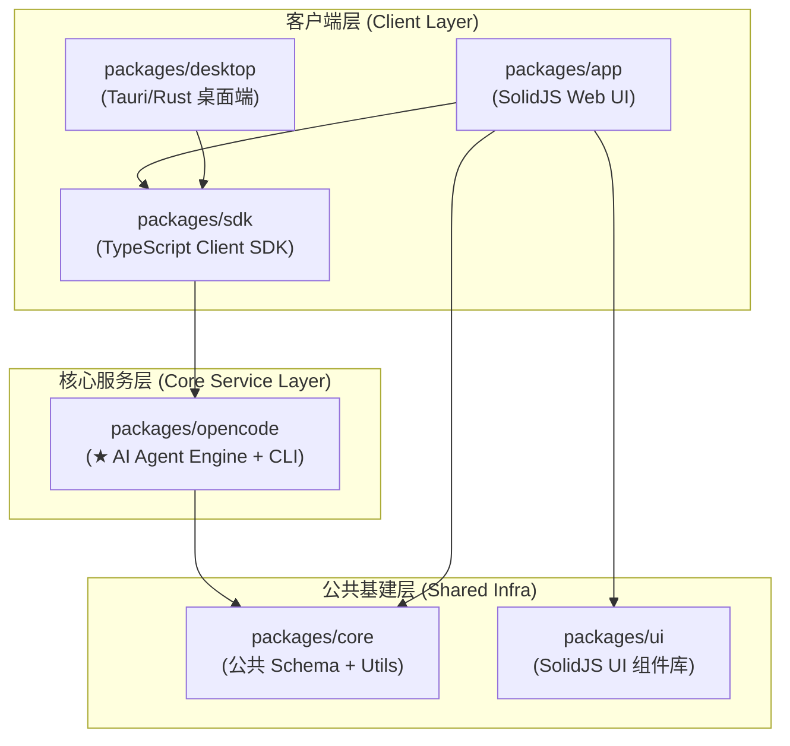
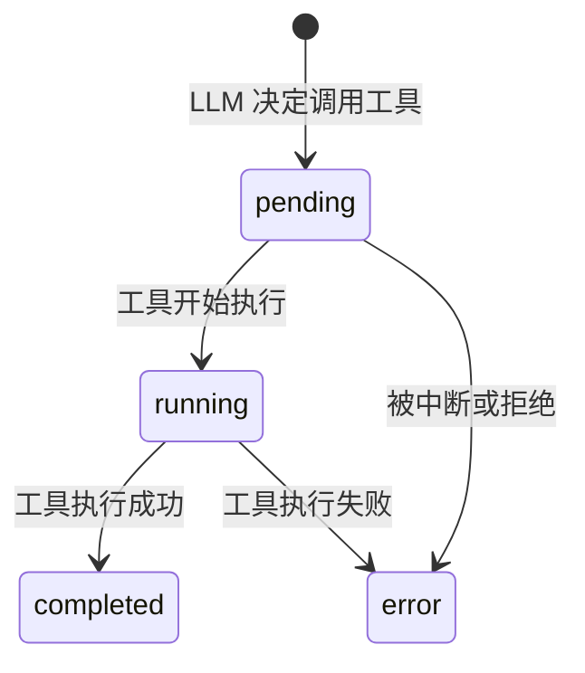
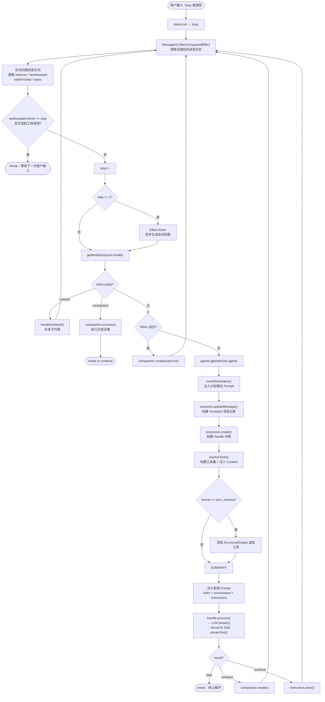
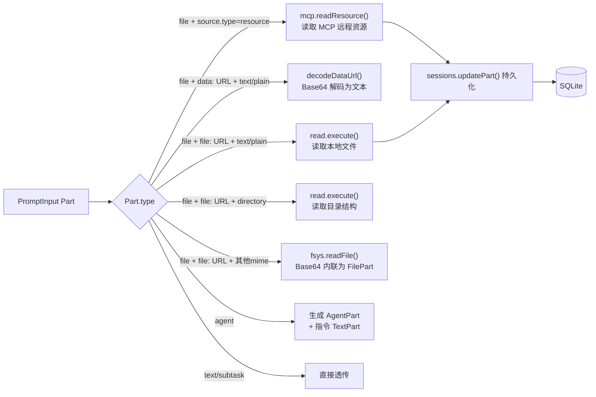
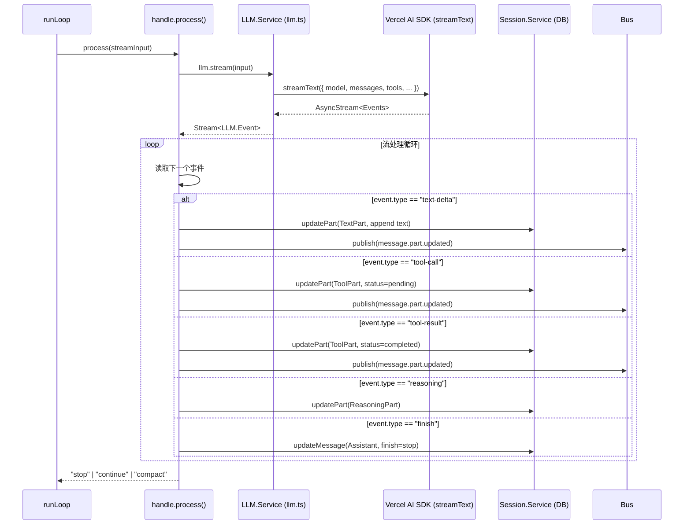
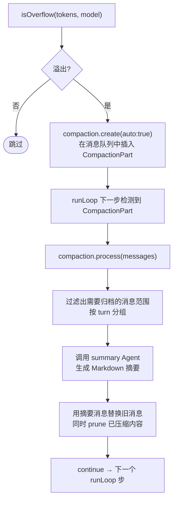
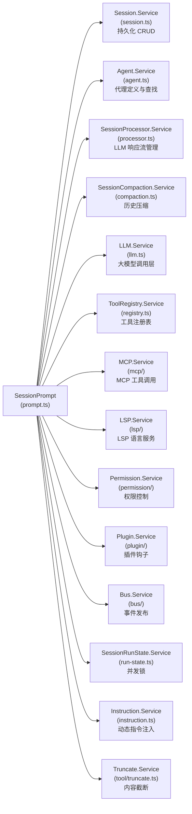

# OpenCode 代码库深度阅读与开发指南

> **作者视角**：本文档以 OpenCode 资深架构师与核心维护者的视角撰写，面向具有扎实编程基础、希望深入参与项目核心开发的工程师。文档遵循「宏观 → 中观 → 微观」的层次结构，并在关键流程处辅以 Mermaid 图表。

---

## 目录

1. [宏观鸟瞰：项目定位与架构全景](#1-宏观鸟瞰项目定位与架构全景)
2. [心智模型与核心技术栈](#2-心智模型与核心技术栈)
3. [核心领域模型（Domain Models）](#3-核心领域模型domain-models)
4. [中视拆解：核心链路与控制流](#4-中视拆解核心链路与控制流)
5. [微观探究：核心文件深度走读](#5-微观探究核心文件深度走读)
6. [参与开发与贡献指南](#6-参与开发与贡献指南)

---

## 1. 宏观鸟瞰：项目定位与架构全景

### 1.1 项目定位

OpenCode 是一个**完全开源、模型厂商中立的 AI 编程助手（Coding Agent）**，其核心设计哲学有以下几点：

- **百分百开源**：不绑定任何特定云模型供应商（Claude、GPT、Gemini、本地模型均支持）。
- **原生 LSP 集成**：Language Server Protocol 允许 AI 像 IDE 一样精确理解代码上下文（跳转定义、符号搜索等）。
- **极客级 TUI**：最初由深度 NeoVim 用户设计，致力于将终端体验推向极限，是"终端内的 Cursor"。
- **Client/Server（C/S）架构**：AI 推理引擎以 Server 形式运行，任意 Client（手机 APP、Web 页面、桌面端）皆可接入，这是架构上最重要的设计决策之一。

### 1.2 Monorepo 目录结构与包职责

项目使用 **Turborepo + Bun** 管理 Monorepo，所有子包位于 `packages/` 目录下：

```
packages/
├── opencode/          # ★★★ 核心大脑：AI Server、CLI、工具执行引擎
├── core/              # ★★  公共基建：Schema定义、共享工具库、全局常量
├── app/               # ★    前端视图：基于 Vite + SolidJS 的 UI 组件
├── desktop/           # ★    桌面端：基于 Rust + Tauri 的原生桌面客户端
├── desktop-electron/  #      历史遗留的 Electron 桌面端实现
├── sdk/               # ★    客户端 SDK：供外部与 OpenCode Server 通信
├── ui/                #      UI 组件库（SolidJS）
├── docs/              #      文档站点
└── ...
```

**各包依赖关系（拓扑视图）：**



### 1.3 核心入口点

根据你想探索的方向，选择对应的入口：

| 入口方向 | 文件路径 | 说明 |
|---|---|---|
| CLI 后端主调度口 | `packages/opencode/src/index.ts` | yargs 注册全部命令（`run`, `serve`, `mcp` 等），通过 `AppRuntime.runPromise` 启动 Effect 环境 |
| Desktop Tauri 入口 | `packages/desktop/src-tauri/src/lib.rs` | Rust 侧的 Tauri 窗口初始化与原生桥接 |
| Desktop 前端桥接 | `packages/desktop/src/cli.ts` | TypeScript 侧的 CLI 命令调用桥接层 |
| HTTP Server 入口 | `packages/opencode/src/server/` | 对外暴露 HTTP API（供 SDK 调用）的 Server 层 |

---

## 2. 心智模型与核心技术栈

### 2.1 Effect-TS：项目的统一并发与副作用框架

这是理解整个项目的**最关键心智模型**。你在阅读代码时会发现几乎没有任何 `try/catch`、`async/await` 或 `Promise.then`——它们统统被 Effect-TS 取代。

#### 2.1.1 `Effect.gen`：统一的异步控制流

Effect 使用 Generator 语法把所有异步操作扁平化：

```typescript
// 在这个项目中你会大量看到这种模式：
const myEffect = Effect.gen(function* () {
  // yield* 代替 await，但背后携带了完整的错误通道和依赖上下文
  const config = yield* Config.Service          // 注入依赖
  const data = yield* Effect.promise(() => fetch(...))  // 包装 Promise
  const result = yield* someOtherEffect         // 调用另一个 Effect

  return result
})
```

#### 2.1.2 `Context.Service` + `Layer`：依赖注入系统

这是项目中**模块能力封装与组装**的核心机制，类似 NestJS 的 IoC 容器，但以函数式方式实现：

```typescript
// 1. 定义一个服务接口
export class Service extends Context.Service<Service, Interface>()("@opencode/MyService") {}

// 2. 实现这个服务（Layer 就是"如何构建这个服务"的声明）
export const layer = Layer.effect(
  Service,
  Effect.gen(function* () {
    // 在这里注入所有依赖
    const dep1 = yield* Dep1.Service
    const dep2 = yield* Dep2.Service

    // 返回服务的具体实现
    return Service.of({ ... })
  })
)
```

**为什么要这么做？**

当你在业务逻辑中调用 `yield* AppFileSystem.Service` 时，你并不关心"它运行在 Windows、Linux 还是被沙盒化的 Web 环境"——这些平台差异由入口处的 `Layer` 提供不同的**具体实现（`LiveLayer`）**来解决。业务代码保持极致干净。

#### 2.1.3 `InstanceState`：多工作区（Multi-Instance）状态隔离

项目使用 `InstanceState` 抽象来支持同时管理多个工作区（WorkTree）的状态。每个 `Instance` 拥有独立的上下文环境（工作目录、配置等），避免了全局状态污染。

### 2.2 其他核心技术

| 技术 | 用途 |
|---|---|
| **Vercel AI SDK** (`ai` 包) | 统一封装各家大模型 API（streamText、tool 调用等），`packages/opencode/src/session/llm.ts` 是封装层 |
| **Drizzle ORM** | 类型安全的 SQLite 数据库操作，所有会话/消息持久化都走这里 |
| **Effect Schema** | 代替 Zod 做运行时类型校验（部分地方仍有 Zod，项目逐渐迁移中） |
| **Bun** | 运行时 + 包管理器，取代 Node.js + npm/yarn |
| **Bus（事件总线）** | `packages/opencode/src/bus/` 中的轻量发布-订阅系统，用于解耦服务间的实时通知 |

---

## 3. 核心领域模型（Domain Models）

### 3.1 `Agent.Info` — 代理定义

**文件**：`packages/opencode/src/agent/agent.ts`

`Agent.Info` 是一个 Schema 定义的纯数据结构，描述一个代理的所有静态属性：

```typescript
// packages/opencode/src/agent/agent.ts
export const Info = Schema.Struct({
  name: Schema.String,               // 代理唯一标识，如 "build", "plan", "general"
  description: Schema.optional(Schema.String),
  mode: Schema.Literals(["subagent", "primary", "all"]),  // 运行模式
  native: Schema.optional(Schema.Boolean),  // 是否为内置代理
  hidden: Schema.optional(Schema.Boolean),
  topP: Schema.optional(Schema.Number),
  temperature: Schema.optional(Schema.Number),
  color: Schema.optional(Schema.String),
  permission: Permission.Ruleset,    // 该代理允许/禁止哪些工具操作
  model: Schema.optional(Schema.Struct({
    modelID: ModelID,
    providerID: ProviderID,
  })),
  variant: Schema.optional(Schema.String),
  prompt: Schema.optional(Schema.String),   // 代理的系统 Prompt
  options: Schema.Record(...),       // 透传给 AI SDK 的额外参数
  steps: Schema.optional(Schema.Number),    // 最大推理步数
})
```

**内置代理**（在 `Agent.layer` 中硬编码）：

| 代理名 | 模式 | 说明 |
|---|---|---|
| `build` | `primary` | 默认代理，允许执行所有工具（含文件读写、Bash） |
| `plan` | `primary` | 计划模式，禁止所有文件编辑工具，只允许只读操作 |
| `general` | `all` | 通用研究代理，常被 `task` 工具作为子代理派发 |
| `explore` | `subagent` | 专门用于代码探索的子代理 |
| `title` | `subagent` | 用于自动生成会话标题的小模型代理 |
| `summary` | `subagent` | 用于历史压缩摘要生成的代理 |

### 3.2 `Session.Info` — 会话信息

**文件**：`packages/opencode/src/session/session.ts`

一个会话对应一次完整的人机交互上下文，持久化在 SQLite 数据库中：

```typescript
// 核心字段（从 session.ts 中的 Schema 定义推断）
type Info = {
  id: SessionID          // ULID 格式的唯一ID
  slug: string           // 用于URL展示的可读标识
  projectID: ProjectID
  workspaceID?: string
  directory: string      // 会话关联的工作目录
  parentID?: SessionID   // 子会话（subtask）的父 Session
  title: string
  version: string
  summary?: {            // Git diff 统计摘要
    additions: number
    deletions: number
    files: number
    diffs?: string
  }
  share?: { url: string }
  revert?: string        // 用于撤回操作的快照引用
  permission?: Permission.Ruleset  // 会话级权限覆写
  time: {
    created: number
    updated: number
    compacting?: number
    archived?: number
  }
}
```

### 3.3 `MessageV2` — 多模态消息协议

**文件**：`packages/opencode/src/session/message-v2.ts`

这是整个通信系统的核心数据结构。每条消息由 `Info`（元数据）+ `Parts`（内容部件）组成，支持多模态内容（文本、文件、工具调用等）。

**消息类型：**

```typescript
// 用户消息
type User = {
  id: MessageID
  role: "user"
  sessionID: SessionID
  time: { created: number }
  agent: string         // 目标代理名称
  model: {
    providerID: ProviderID
    modelID: ModelID
    variant?: string
  }
  tools?: Record<string, boolean>   // @deprecated，使用 permission 代替
  system?: string
  format?: OutputFormat  // 支持 json_schema 结构化输出
}

// 助手消息
type Assistant = {
  id: MessageID
  role: "assistant"
  sessionID: SessionID
  parentID: MessageID   // 对应的用户消息 ID
  agent: string
  mode: string
  modelID: ModelID
  providerID: ProviderID
  cost: number
  tokens: {
    input: number; output: number; reasoning: number
    cache: { read: number; write: number }
  }
  path: { cwd: string; root: string }
  finish?: string       // "stop" | "tool-calls" | "length" | "content-filter" | ...
  error?: object        // 序列化的错误对象
  summary?: boolean     // 是否为摘要消息（Compaction 产物）
  structured?: unknown  // 结构化输出的结果
  time: { created: number; completed?: number }
}
```

**Part 类型大全（消息内容部件）：**

| Part 类型 | 说明 |
|---|---|
| `TextPart` | 普通文本内容，可标记 `synthetic`（系统注入的隐式内容） |
| `ReasoningPart` | 模型的思考链（Reasoning/Chain-of-Thought）内容 |
| `FilePart` | 附件文件，支持 `data:` URL（Base64内联）和 `file:` URL（本地路径） |
| `ToolPart` | 工具调用记录，包含 `state`（`pending/running/completed/error`）状态机 |
| `AgentPart` | 引用另一个 Agent 的声明（用于 `@agent-name` 语法） |
| `SubtaskPart` | 异步子任务声明，用于派发子代理执行并行任务 |
| `CompactionPart` | 触发上下文压缩的信号部件 |
| `SnapshotPart` | 文件系统快照引用（用于 Revert 功能） |
| `PatchPart` | Git Patch 记录（记录本次 AI 操作造成的文件变更） |

**ToolPart 的状态机：**



### 3.4 `Tool.Def` — 工具定义协议

**文件**：`packages/opencode/src/tool/tool.ts`

所有工具（Bash、Read、Edit 等）都遵循同一个接口：

```typescript
export interface Def<Parameters, M extends Metadata> {
  id: string
  description: string
  parameters: Parameters   // Effect Schema 定义工具输入的类型
  execute(
    args: Schema.Schema.Type<Parameters>,
    ctx: Context
  ): Effect.Effect<ExecuteResult<M>>
}

export type Context = {
  sessionID: SessionID
  messageID: MessageID
  agent: string
  abort: AbortSignal            // 用于中断长时任务
  callID?: string
  messages: MessageV2.WithParts[]
  metadata(input: { title?: string; metadata?: any }): Effect.Effect<void>  // 更新 UI 状态
  ask(input: ...): Effect.Effect<void>   // 向用户请求权限
}
```

---

## 4. 中视拆解：核心链路与控制流

### 4.1 Agent 主循环引擎 (The Agent Loop)

**核心文件**：`packages/opencode/src/session/prompt.ts`

这是整个项目最核心、最复杂的文件。它以 `Layer.effect` 构建 `SessionPrompt.Service`，在 `layer` 函数内部通过闭包封装了所有核心函数。

#### 4.1.1 `prompt.ts` 整体结构

```
packages/opencode/src/session/prompt.ts
│
├── 导入所有依赖服务（Bus, Session, Agent, Provider 等）
│
├── Interface（公开的服务接口定义）
│   ├── cancel(sessionID)
│   ├── prompt(PromptInput)        → 创建用户消息 + 启动 runLoop
│   ├── loop(LoopInput)            → 仅推进 runLoop（不创建用户消息）
│   ├── shell(ShellInput)          → 执行用户直接发起的 Shell 命令
│   └── command(CommandInput)      → 执行斜杠命令（/cmd）
│
├── Service（Context.Service 定义，用于依赖注入）
│
└── layer（Layer.effect 工厂，构建 Service 实现）
    │
    ├── 依赖注入（所有依赖在此处获取）
    │   ├── bus, status, sessions, agents, provider
    │   ├── processor, compaction, plugin, commands, permission
    │   ├── fsys, mcp, lsp, registry, truncate, spawner
    │   ├── instruction, state, revert, summary, sys, llm
    │   └── runner（EffectBridge：桥接 Effect 和 Promise 世界）
    │
    ├── cancel()                   内部实现
    ├── resolvePromptParts()       解析 Prompt 模板中的文件/Agent 引用
    ├── title()                    异步生成会话标题
    ├── insertReminders()          注入计划模式的系统提醒
    ├── resolveTools()             ★ 构建工具集（本地+MCP），注入执行上下文
    ├── handleSubtask()            ★ 处理子任务 SubtaskPart 的派发与完成
    ├── shellImpl()                Shell 命令物理执行实现
    ├── getModel()                 模型解析（带错误提示）
    ├── lastModel()                获取会话最近一次使用的模型
    ├── createUserMessage()        ★ 创建用户消息并持久化所有 Parts
    ├── prompt()                   公开方法：创建消息 + 触发 loop
    ├── lastAssistant()            获取最后一条助手消息
    ├── runLoop()                  ★★★ 核心推理主循环
    ├── loop()                     包装 runLoop，注入并发锁控制
    ├── shell()                    包装 shellImpl，注入并发锁控制
    └── command()                  斜杠命令的解析与执行
```

#### 4.1.2 `runLoop` — 详解

`runLoop` 是整个 Agent 引擎的心脏，位于 `prompt.ts` 约第 1320 行处，是一个用 `Effect.fn` 包裹的 `while(true)` 状态机。

**完整流程图：**



#### 4.1.3 关键内部函数逐一解析

---

##### `resolveTools(input)` — 工具集构建器

**作用**：将所有可用工具包装成 AI SDK 所需的 `AITool` 格式，并注入工具执行上下文。

**流程**：
1. 调用 `registry.tools({ modelID, providerID, agent })` 获取当前 Agent 允许使用的内置工具列表（会按 Agent 的权限规则过滤）。
2. 对每个工具调用 `ProviderTransform.schema()` 对 JSON Schema 进行模型厂商适配（例如 Anthropic 不支持某些 Schema 特性）。
3. 为每个工具的 `execute` 函数注入 `Tool.Context`：
   - `ctx.abort`：连接到当前会话的 AbortController，用于随时中断。
   - `ctx.metadata()`：更新 UI 中工具的实时运行状态（`pending → running`）。
   - `ctx.ask()`：路由到 `Permission.Service`，在执行高风险操作前弹出用户授权请求。
4. 触发 `plugin.trigger("tool.execute.before" / "after")` 插件生命周期钩子。
5. 同样处理 **MCP 工具**：通过 `mcp.tools()` 获取所有远程 MCP Server 注册的工具，同样应用相同的封装逻辑，并在执行时通过 `ctx.ask()` 强制要求用户授权（因为 MCP 工具不在本地白名单内）。

```typescript
// 核心简化逻辑（packages/opencode/src/session/prompt.ts）
const resolveTools = Effect.fn("SessionPrompt.resolveTools")(function* (input) {
  const tools: Record<string, AITool> = {}
  const run = yield* runner()  // EffectBridge：让 execute() 可以是同步 Promise

  // 工具执行上下文工厂
  const context = (args, options): Tool.Context => ({
    sessionID: input.session.id,
    abort: options.abortSignal,
    messageID: input.processor.message.id,
    callID: options.toolCallId,
    // ★ metadata 回调：把实时状态推送给 UI
    metadata: (val) => input.processor.updateToolCall(options.toolCallId, ...),
    // ★ ask 回调：路由到权限检查系统
    ask: (req) => permission.ask({ ...req, ruleset: Permission.merge(...) }).pipe(Effect.orDie),
  })

  // 1. 注册本地工具
  for (const item of yield* registry.tools({ modelID, providerID, agent })) {
    const schema = ProviderTransform.schema(input.model, EffectZod.toJsonSchema(item.parameters))
    tools[item.id] = tool({
      description: item.description,
      inputSchema: jsonSchema(schema),
      execute(args, options) {
        return run.promise(
          Effect.gen(function* () {
            const ctx = context(args, options)
            yield* plugin.trigger("tool.execute.before", ...)
            const result = yield* item.execute(args, ctx)   // ← 真正执行
            yield* plugin.trigger("tool.execute.after", ...)
            return result
          })
        )
      }
    })
  }

  // 2. 注册 MCP 工具（远程工具，执行时需要 ask）
  for (const [key, item] of Object.entries(yield* mcp.tools())) {
    // ... 类似逻辑，但添加了 ctx.ask() 强制授权
    tools[key] = item
  }

  return tools
})
```

---

##### `handleSubtask(input)` — 子任务派发器

**作用**：当 AI 决定将某个任务委托给子代理（通过 `SubtaskPart`）时，此函数负责创建子代理的上下文并执行。

**流程**：
1. 创建一个 Assistant 消息（代理父 Agent 的视角，显示"正在执行子任务"）。
2. 在该 Assistant 消息下创建一个 `ToolPart`（工具名为 `"task"`），初始状态为 `running`。
3. 调用 `taskTool.execute()` 实际派发子任务（`TaskTool` 会创建子 Session 并递归调用 `loop`）。
4. 捕获中断信号（用户取消时，将 ToolPart 状态更新为 `error: "Cancelled"`）。
5. 执行完成后，将 ToolPart 更新为 `completed` 或 `error` 状态。
6. 如果 `task.command` 不为空，追加一条 User 消息，提示父代理继续执行。

---

##### `createUserMessage(input)` — 用户消息构建器

**作用**：将原始 `PromptInput`（可能包含文件路径、Agent 引用等）转换为完整的、可持久化的 `MessageV2.User + Parts`。

**`resolvePart` 内部的多态处理**：



---

##### `shellImpl(input)` — Shell 命令执行器

**作用**：处理用户通过快捷方式直接执行的 Shell 命令（不经过 LLM），如 `Ctrl+E` 快捷命令。

**关键设计**：
- 根据当前 Shell（`zsh`, `bash`, `fish`, `nu`, `pwsh`, `cmd` 等）选择不同的命令调用参数。
- 使用 `Effect/unstable/process` 的 `ChildProcess.make()` + `spawner.spawn()` 以流式方式执行命令。
- 通过 `Stream.runForEach(Stream.decodeText(handle.all), ...)` 实时拼接输出并 `void run.fork(sessions.updatePart(part))` 推送到 UI。
- 使用 `Effect.onInterrupt` 处理用户中断（Ctrl+C），标记 `aborted = true` 并在 `finish` 阶段追加 metadata。

---

##### `command(input)` — 斜杠命令处理器

**作用**：处理 `/command-name [arguments]` 形式的用户指令。

**流程**：
1. 通过 `commands.get(name)` 查找命令定义（命令由配置文件和插件注册）。
2. 解析参数：支持 `$1`, `$2`, `$ARGUMENTS` 等占位符替换。
3. 支持 `` !`shell-cmd` `` 语法在模板中嵌入 Shell 命令执行结果。
4. 根据 `cmd.subtask` 标志决定是直接以 `prompt` 方式发送，还是封装为 `SubtaskPart`。
5. 触发 `plugin.trigger("command.execute.before")` 插件钩子。
6. 调用 `prompt()` 发送最终的消息。

---

### 4.2 会话处理器 (`SessionProcessor`)

**文件**：`packages/opencode/src/session/processor.ts`

`SessionProcessor.Service` 是 `runLoop` 每一步的"助手消息生命周期管理员"，负责管理一次 LLM 响应从开始到结束的全过程。

#### 4.2.1 `create(input)` — 创建处理句柄

每次进入 `runLoop` 的一步（一次 LLM 请求），都会调用 `processor.create()` 获取一个 `Handle`，它包含：

- `message`：当前正在处理的 `MessageV2.Assistant` 对象（可变）。
- `updateToolCall(toolCallID, update)`：更新某个工具调用的 `ToolPart` 状态（如 `pending → running`）。
- `completeToolCall(toolCallID, output)`：完成某个工具调用，将 `ToolPart` 状态更新为 `completed`。
- `process(streamInput)`：核心方法，调用 `LLM.stream()` 并处理流式响应。

#### 4.2.2 `handle.process()` — LLM 流处理

`process()` 的返回值是 `Effect.Effect<Result>`，其中 `Result = "compact" | "stop" | "continue"`。

**内部流程（简化）**：



**防崩溃设计（Doom Loop 检测）**：`processor.ts` 中定义了 `DOOM_LOOP_THRESHOLD = 3`。如果在连续的多步中检测到无意义的重复工具调用（无实质进展），会自动中止循环，防止 Token 无限消耗。

---

### 4.3 LLM 服务层

**文件**：`packages/opencode/src/session/llm.ts`

`LLM.Service` 封装了对 Vercel AI SDK 的所有调用，是 OpenCode 与各家大模型之间的**最后一层薄封装**。

#### `LLM.stream(input)` — 核心流方法

**输入**：`StreamInput`（包含 agent、model、system、messages、tools 等）。
**输出**：`Stream.Stream<LLM.Event>`。

**关键内部操作**：
1. **并行获取配置**：`Effect.all([provider.getLanguage, config.get, provider.getProvider, auth.get], { concurrency: "unbounded" })`——四路并发，不浪费等待时间。
2. **System Prompt 组装**：按优先级拼接 Agent Prompt + 模型厂商特定 Prompt + 自定义 System + 用户 System（`user.system`）。
3. **Variant 处理**：支持模型变体（如 `extended-thinking` vs `standard`）。
4. **参数合并**：通过 `pipe(base, mergeDeep(model.options), mergeDeep(agent.options), mergeDeep(variant))` 支持多层配置覆写。
5. **插件钩子**：`plugin.trigger("chat.params")` 和 `plugin.trigger("chat.headers")` 允许插件修改请求参数和 HTTP 头。
6. **工具解析**：调用内部 `resolveTools` 对工具 Schema 进行最终的模型适配（如 Anthropic 的工具定义格式与 OpenAI 不同）。
7. **调用 `streamText()`**：最终调用 Vercel AI SDK 的 `streamText()` 发起流式请求。

---

### 4.4 并发控制与状态锁

**文件**：`packages/opencode/src/session/run-state.ts`

`SessionRunState.Service` 防止同一个会话的多次并发请求互相冲突。

#### `ensureRunning(sessionID, onInterrupt, work)`

这是 `loop()` 的实际入口包装器：

```typescript
// loop 的实现
const loop = Effect.fn("SessionPrompt.loop")(function* (input: LoopInput) {
  return yield* state.ensureRunning(
    input.sessionID,
    lastAssistant(input.sessionID),  // 中断时返回最后一条助手消息
    runLoop(input.sessionID),         // 实际工作
  )
})
```

**内部机制**：
- 每个 Session 维护一个 `Runner.Runner<MessageV2.WithParts>`（基于 Scope 和 AbortController）。
- 如果 Session 已经有运行中的任务（`runner.busy === true`），新请求会抛出 `Session.BusyError`。
- `cancel()` 方法会触发 `runner.cancel`，通过 AbortController 中断正在流式生成的 LLM 请求和工具执行。

---

### 4.5 上下文压缩系统（Compaction）

**文件**：`packages/opencode/src/session/compaction.ts`

当会话历史接近模型的 Context Window 上限时，Compaction 系统负责"归档旧历史"，保留关键信息。

**工作流程**：



**`SUMMARY_TEMPLATE`**：在 `compaction.ts` 中定义了固定的摘要模板，强制 AI 输出标准化的 Markdown 结构（Goal / Progress / Key Decisions / Next Steps / Relevant Files），确保压缩后的信息密度和可用性。

---

### 4.6 工具执行系统深度解析

**文件目录**：`packages/opencode/src/tool/`

#### 4.6.1 工具注册表（ToolRegistry）

**文件**：`packages/opencode/src/tool/registry.ts`

`ToolRegistry.Service` 负责管理所有工具的注册和按 Agent/Model 过滤。

**`tools({ modelID, providerID, agent })` 方法**：根据当前 Agent 的权限规则（`agent.permission`），通过 `Permission.evaluate()` 决定哪些工具可以暴露给 LLM。例如，`plan` Agent 中 `edit`, `write`, `bash` 等工具被 `deny`，因此不会出现在工具列表中。

**内置工具列表**：

| 工具 ID | 文件 | 说明 |
|---|---|---|
| `bash` | `tool/bash.ts` | 执行 Shell 命令（通过 `ChildProcess` 或 PTY） |
| `read` | `tool/read.ts` | 读取文件或目录结构（支持行范围、符号解析） |
| `write` | `tool/write.ts` | 创建或覆写文件 |
| `edit` | `tool/edit.ts` | 精确的字符串替换编辑 |
| `apply_patch` | `tool/apply_patch.ts` | 应用 unified diff 格式的 Patch |
| `glob` | `tool/glob.ts` | 文件模式匹配（`**/*.ts` 等） |
| `grep` | `tool/grep.ts` | 在文件内容中正则搜索（集成 Ripgrep） |
| `webfetch` | `tool/webfetch.ts` | 抓取网页内容（带 Markdown 转换） |
| `websearch` | `tool/websearch.ts` | 网络搜索（集成外部搜索 API） |
| `codesearch` | `tool/codesearch.ts` | 语义代码搜索（集成 Exa AI） |
| `lsp` | `tool/lsp.ts` | 调用 LSP 功能（查找引用、跳转定义、悬停信息等） |
| `task` | `tool/task.ts` | 派发子代理任务（创建子 Session） |
| `question` | `tool/question.ts` | 向用户提问（阻塞等待回答） |
| `skill` | `tool/skill.ts` | 读取自定义 Skill 文件（`.md` 文档作为工具知识） |
| `todowrite` | `tool/todo.ts` | 维护 TODO 列表 |
| `plan_enter` | `tool/plan.ts` | 进入计划模式 |
| `plan_exit` | `tool/plan.ts` | 退出计划模式（提交计划） |

#### 4.6.2 `Tool.define()` — 工具定义范式

**文件**：`packages/opencode/src/tool/tool.ts`

所有工具都通过 `Tool.define()` 或 `Tool.init()` 定义，统一经过 `wrap()` 函数包装：

```typescript
// 以 bash.ts 为例（简化）
export const BashTool = Tool.define(
  "bash",
  Effect.gen(function* () {
    const fsys = yield* AppFileSystem.Service
    // ... 获取其他依赖

    return {
      description: "Execute a shell command...",
      parameters: Schema.Struct({
        command: Schema.String,
        timeout: Schema.optional(Schema.Number),
      }),
      execute(args, ctx) {
        return Effect.gen(function* () {
          // 1. 调用 ctx.ask() 检查权限
          yield* ctx.ask({ permission: "bash", ... })
          // 2. 执行实际命令
          const output = yield* runCommand(args.command)
          return { title: "bash", metadata: {...}, output }
        })
      }
    }
  })
)
```

**`wrap()` 函数的作用（对使用者透明）**：
1. **输入校验**：在 `execute` 被调用前，通过 `Schema.decodeUnknownEffect` 校验 LLM 传来的参数，格式不对时返回友好错误信息给 LLM。
2. **自动截断**：在 `execute` 返回后，如果输出内容过长，自动调用 `Truncate.output()` 截断，并将完整输出保存到临时文件，返回截断后的文本 + 文件引用。
3. **链路追踪**：通过 `Effect.withSpan("Tool.execute", { attributes })` 注入 OpenTelemetry 追踪属性。

#### 4.6.3 `Truncate.Service` — 内容截断保护

**文件**：`packages/opencode/src/tool/truncate.ts`

这是防止 LLM Context 爆炸的最后一道防线。当任何工具（本地工具或 MCP 工具）返回的内容超过阈值时：
1. 将完整内容写入到一个临时文件。
2. 在返回结果中添加 `truncated: true` 标记。
3. 附上文件路径，让 LLM 可以自行用 `read` 工具读取完整内容。

---

## 5. 微观探究：核心文件深度走读

### 5.1 `packages/opencode/src/session/prompt.ts` — 详细架构剖析

#### 文件级概述

| 维度 | 内容 |
|---|---|
| 行数 | ~1870 行 |
| 导出 | `Interface`, `Service`, `layer`, `defaultLayer`, `PromptInput`, `LoopInput`, `ShellInput`, `CommandInput`, `createStructuredOutputTool` |
| 核心模式 | **大型闭包模式**：`layer` 函数内部所有方法共享同一批依赖（通过闭包捕获），避免参数穿透 |
| 设计亮点 | `runner()` + `EffectBridge` 模式将 Effect 世界暴露为可在 AI SDK 的 Promise-based `execute` 回调中使用的接口 |

#### 模块间依赖关系



#### `defaultLayer` — 完整依赖树

`defaultLayer` 是这个模块对外暴露的"一键初始化"入口，它通过 `Layer.provide` 链式声明了所有依赖的默认实现：

```typescript
// packages/opencode/src/session/prompt.ts
export const defaultLayer = Layer.suspend(() =>
  layer.pipe(
    Layer.provide(SessionRunState.defaultLayer),
    Layer.provide(SessionStatus.defaultLayer),
    Layer.provide(SessionCompaction.defaultLayer),
    Layer.provide(SessionProcessor.defaultLayer),
    Layer.provide(Command.defaultLayer),
    Layer.provide(Permission.defaultLayer),
    Layer.provide(MCP.defaultLayer),
    Layer.provide(LSP.defaultLayer),
    Layer.provide(ToolRegistry.defaultLayer),
    Layer.provide(Truncate.defaultLayer),
    Layer.provide(Provider.defaultLayer),
    Layer.provide(Instruction.defaultLayer),
    Layer.provide(AppFileSystem.defaultLayer),
    Layer.provide(Plugin.defaultLayer),
    Layer.provide(Session.defaultLayer),
    Layer.provide(SessionRevert.defaultLayer),
    Layer.provide(SessionSummary.defaultLayer),
    Layer.provide(
      Layer.mergeAll(
        Agent.defaultLayer,
        SystemPrompt.defaultLayer,
        LLM.defaultLayer,
        Bus.layer,
        CrossSpawnSpawner.defaultLayer,
      ),
    ),
  ),
)
```

---

### 5.2 `packages/opencode/src/session/message-v2.ts` — 消息协议设计

#### 文件级概述

| 维度 | 内容 |
|---|---|
| 行数 | ~900+ 行 |
| 核心导出 | 所有 Part 类型、User/Assistant Message 类型、错误类型、工具函数 |
| 设计亮点 | Part 类型系统完全依赖 Schema 驱动，运行时类型安全 + 自动序列化/反序列化 |

#### `toModelMessagesEffect(messages, model)` — 消息格式转换

这是一个关键的转换函数，负责把 OpenCode 内部的 `MessageV2.WithParts[]` 格式转换为 Vercel AI SDK 期望的 `ModelMessage[]` 格式，供大模型消费。

**主要逻辑**：
- 遍历消息历史，根据 `role` 和 `part.type` 生成对应的 SDK 消息格式。
- `synthetic: true` 的 TextPart 会被透明插入（用户看不到，但 LLM 能看到）。
- `ignored: true` 的 TextPart 会被跳过（用于隐藏已撤回的用户输入）。
- 图片（FilePart with image MIME）会被转为 Base64 `image` 内容块。
- 工具结果（ToolPart with `completed` 状态）会生成 `tool-result` 格式。

#### 错误类型体系

`message-v2.ts` 中定义了完整的领域错误类型，所有错误都使用 `namedSchemaError` 工厂函数构建，可以被序列化为 JSON 后存储在数据库中：

```typescript
// 可序列化的错误类型
OutputLengthError       // 输出长度超限
AbortedError            // 用户主动中止
StructuredOutputError   // 结构化输出失败（模型未使用指定工具）
AuthError               // Provider 认证失败
APIError                // Provider API 调用失败
ContextOverflowError    // Context Window 溢出
```

---

### 5.3 `packages/opencode/src/agent/agent.ts` — Agent 生命周期

#### 文件级概述

| 维度 | 内容 |
|---|---|
| 行数 | ~400+ 行 |
| 核心导出 | `Info`（Schema）, `Service`, `layer`, `defaultLayer` |
| 设计亮点 | `InstanceState.make` 实现多工作区隔离的代理状态缓存 |

#### `Agent.Service.get(name)` — 代理获取

`get()` 返回的是 `Info` 对象，Agent 的权限规则通过 `Permission.merge()` 按优先级叠加：

```
优先级（低 → 高）：
defaults（项目默认权限）→ agent特定权限 → user配置权限（~/.opencode/config.json 中的 permission）
```

#### `Agent.Service.generate(input)` — AI 自动生成 Agent

这是一个有趣的元能力：使用大模型自动生成一个新的 Agent 定义（identifier、whenToUse、systemPrompt），供用户保存到配置文件中。

---

## 6. 参与开发与贡献指南

### 6.1 开发原则（来自 `AGENTS.md`）

#### 代码风格核心规则

```typescript
// ✅ 好：内联一次性变量
const journal = await Bun.file(path.join(dir, "journal.json")).json()

// ❌ 坏：不必要的中间变量
const journalPath = path.join(dir, "journal.json")
const journal = await Bun.file(journalPath).json()

// ✅ 好：点访问保留上下文
obj.a
obj.b

// ❌ 坏：冗余解构
const { a, b } = obj

// ✅ 好：Early Return，无 else
function foo() {
  if (condition) return 1
  return 2
}

// ❌ 坏：不必要的 else
function foo() {
  if (condition) return 1
  else return 2
}
```

#### 类型系统规则

- **禁止 `any` 类型**：永远不要写 `any`，使用 `unknown` + 类型守卫或显式泛型。
- **类型推导优先**：只有在**导出的 API 边界**或**需要防止下游类型塌陷**时才写显式类型标注。
- **使用 Schema 而不是接口**：领域对象用 Effect Schema 或 Zod 定义，可以同时享有类型和运行时校验。

#### 测试规则

- **避免 Mock**：不要 Mock 实现细节，测试真实的代码路径。
- **不要重复逻辑**：测试只验证行为结果，不要把被测代码的逻辑抄一遍到测试文件里。

#### Drizzle Schema 规范

```typescript
// ✅ 使用 snake_case 字段名（列名无需重复声明）
const table = sqliteTable("session", {
  id: text().primaryKey(),
  project_id: text().notNull(),
  created_at: integer().notNull(),
})

// ❌ 不必要的字符串列名
const table = sqliteTable("session", {
  id: text("id").primaryKey(),
  projectID: text("project_id").notNull(),
})
```

### 6.2 本地开发工作流

#### 环境准备

```bash
# 克隆仓库
git clone <repo-url>
cd opencode

# 安装依赖（Bun 会自动处理 workspace）
bun install
```

#### 开发调试

```bash
# 进入核心包目录（重要！测试不能从根目录运行）
cd packages/opencode

# 类型检查（使用 bun typecheck，不要用 tsc）
bun typecheck

# 运行测试（同样在包目录下）
bun test

# 运行特定测试文件
bun test src/session/prompt.test.ts
```

#### 开发模式运行

```bash
# 在 packages/opencode 目录
bun run src/index.ts tui  # 启动 TUI 模式
bun run src/index.ts run "your prompt here"  # 单次运行模式
```

#### SDK 重新生成

如果你修改了 API 定义，需要重新生成 JavaScript SDK：

```bash
# 在仓库根目录
./packages/sdk/js/script/build.ts
```

### 6.3 新手贡献路径建议

**适合新手的 Issue 类型（由易到难）**：

1. **文档/注释改进**：补充缺失的 JSDoc 注释、修复文档中的错误。
2. **错误信息优化**：改进 CLI 错误输出的可读性（`packages/opencode/src/cli/`）。
3. **小工具增强**：给现有工具（如 `read.ts`, `glob.ts`）增加边界情况处理。
4. **新 Tool 开发**：按照 `Tool.define()` 范式新增工具，需同时补充对应的 `.txt` 文件（工具描述文档）。
5. **Provider 适配**：增加新的 AI 模型提供商支持（`packages/opencode/src/provider/`）。
6. **Bug 修复**：修复 `runLoop` 或 `processor.ts` 中的状态机边界 Bug（需要对主循环有深入理解）。

### 6.4 核心文件阅读顺序建议

按照以下顺序阅读，可以最高效地建立心智模型：

```
第一步（理解数据模型）
  packages/opencode/src/session/schema.ts       ← ID 类型定义
  packages/opencode/src/session/message-v2.ts   ← 消息协议（重点读 Part 类型）
  packages/opencode/src/session/session.sql.ts  ← 数据库表结构

第二步（理解服务层）
  packages/opencode/src/session/session.ts      ← Session CRUD 服务
  packages/opencode/src/agent/agent.ts          ← Agent 定义与管理
  packages/opencode/src/tool/tool.ts            ← 工具定义基础设施

第三步（理解执行层）
  packages/opencode/src/session/llm.ts          ← LLM 调用封装
  packages/opencode/src/session/processor.ts   ← LLM 响应流处理
  packages/opencode/src/session/run-state.ts   ← 并发控制

第四步（理解主循环）
  packages/opencode/src/session/prompt.ts      ← ★ 核心：主循环与编排

第五步（理解周边系统）
  packages/opencode/src/session/compaction.ts  ← 上下文压缩
  packages/opencode/src/tool/registry.ts       ← 工具注册表
  packages/opencode/src/permission/            ← 权限系统
  packages/opencode/src/mcp/                   ← MCP 集成
```

---

## 附录：常见问题与陷阱

### Q: 为什么工具的 `execute` 方法是同步的 Promise，而不是 Effect？

因为 Vercel AI SDK 的工具接口要求 `execute` 返回 `Promise`。项目通过 `EffectBridge.make()` + `run.promise(...)` 在 Effect 和 Promise 之间架桥，实现了在 Promise 接口内部运行 Effect 程序的能力。

### Q: 如何在调试时追踪一个工具调用的完整生命周期？

1. 在 `resolveTools()` 中找到对应工具的 `execute` 包装处打断点。
2. 查看 `plugin.trigger("tool.execute.before")` 触发的事件（可能有插件修改参数）。
3. 追踪 `sessions.updatePart()` 调用了解 ToolPart 状态变化。
4. 注意 `processor.completeToolCall()` 是如何将工具结果写回消息历史的。

### Q: 如何添加一个全新的 MCP 工具并让它生效？

MCP 工具是动态注册的，不需要修改代码。在用户配置文件（`~/.opencode/config.json`）中添加 MCP Server 配置，运行时 `MCP.Service.tools()` 会自动发现并注册。如果需要修改 MCP 工具的权限默认值，查看 `agent.ts` 中的 `defaults` 权限配置（`external_directory` 相关部分）。

### Q: `synthetic: true` 的 TextPart 有什么作用？

它表示这部分内容是系统自动注入的（而非真实用户输入），在 UI 层通常隐藏不显示，但会被发送给 LLM。例如：读取文件时系统自动注入的文件内容、计划模式下的系统提醒（`insertReminders`）等。

### Q: `compaction` 和 `summary` 的区别是什么？

- **`compaction`**：整个历史归档操作，将多轮对话压缩为一个摘要消息，减少 Token 占用。是应对 Context Window 溢出的机制。
- **`summary`**（`packages/opencode/src/session/summary.ts`）：即时摘要，用于在 Session 列表中显示对话内容预览（不影响 LLM 的实际上下文）。
